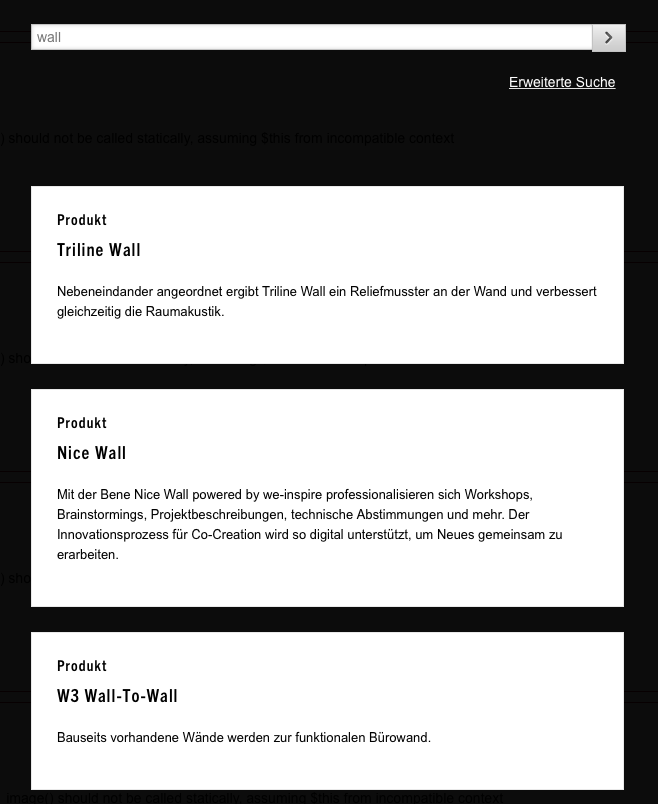
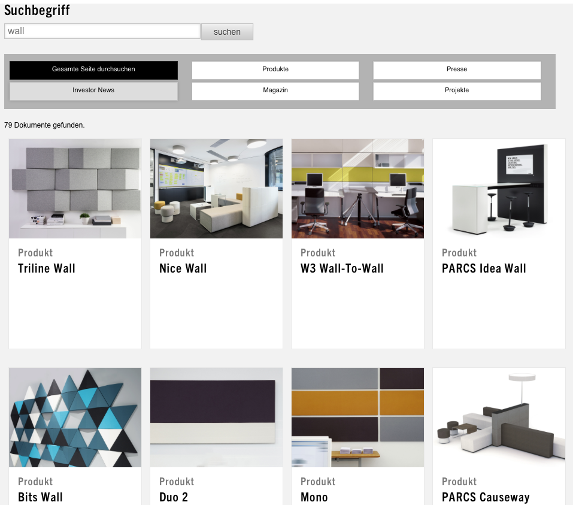

# Weighted Search - Gewichtete Suche

*Weighted Search* ist eine Erweiterung für Expression Engine (EE), die es erlaubt eine Suche in einer Datenstruktur je nach Ort zu gewichten.

Als Beispiel: Kommt der Suchbegriff im Titel einer Ressource vor hat dies ein höheres Gewicht als ein Vorkommen im Inhalt einer Ressource. Die jeweiligen "Einzelgewichte" werden addiert und ergeben das für diese Ressource im Zusammenhang mit dem Suchbegriff Gesamtgewicht.

## Backend (BE)

Im BE von EE stehen unter `Addons -> Extensions -> Weighted Search -> Settings` mehrere Felder zur Verfügung um das Gewicht einer Ressourcen-Eigenschaft (Tabelleneigenschaft) zu bestimmen.

### Felder & Kanäle

Jedem angeführten Feld/Kanal kann im BE ein Gewicht gegeben werden:

**Felder**

* Field Title	
* Field 'Body'	
* Field 'Address'	
* Field 'Year'	
* Field 'Architect'	
* Field 'Teaser'	
* Field 'Contact Person'	
* Field 'Corporate Name'	
* Field 'Business'	
* Field 'Client'	
* Field 'Short Bio'	
* Field 'Awardslist'	
* Field 'Tags'	
* Field 'Designer external'	
* Field 'Feature'	
* Field 'Search Field'	

**Kanäle**

* Channel 'Products'	
* Channel 'Pages'	
* Channel 'Brochures'	
* Channel 'Zones & Areas'	
* Channel 'Planning & Design'	
* Channel 'Awards'	
* Channel 'Certifications'	
* Channel 'Inspirations'	
* Channel 'Project reports'	
* Channel 'Branches'	
* Channel 'Brands'	
* Channel 'Designer'	
* Channel 'Magazine Articles'	
* Channel 'Image Downloads'	
* Channel 'Collections'	
* Channel 'New year cards'	
* Channel 'Press'	
* Channel 'Investor Relations'	
* Channel 'Microsite'	
* Channel 'Feed'	
* Channel 'Human Ressources'	
* Channel 'iTunes RSS'	
* Channel 'Reports'	
* Channel 'RSS'	
* Channel 'SEO Feeds'	
* Channel 'Category Information'	
* Channel 'Products Subpage'	
* Channel 'Client List'	
* Channel 'Startpage'	
* Channel 'Non structure Pages'	
* Channel 'Landing Pages'	
* Channel 'CADdata'	
* Channel 'Zones & Areas Settings'

## Frontend (FE)

Im FE steht, unverändert, die Suche über das Hauptmenü zur Verfügung und liefert die Suchergebnisse sortiert nach deren Gesamtgewicht aus. Dies wird für beide Eingabemasken ausgeführt und kann nicht unterschiedlich gewichtet werden.

